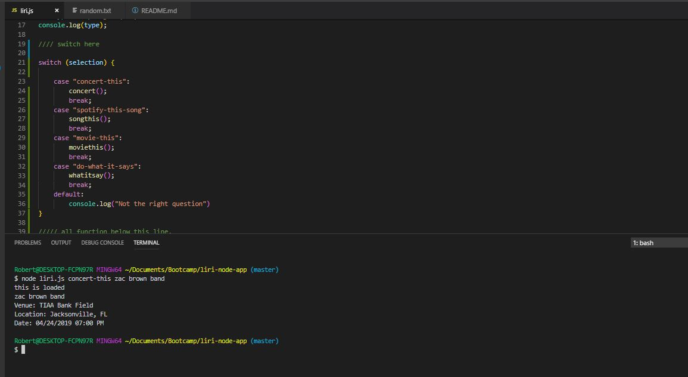
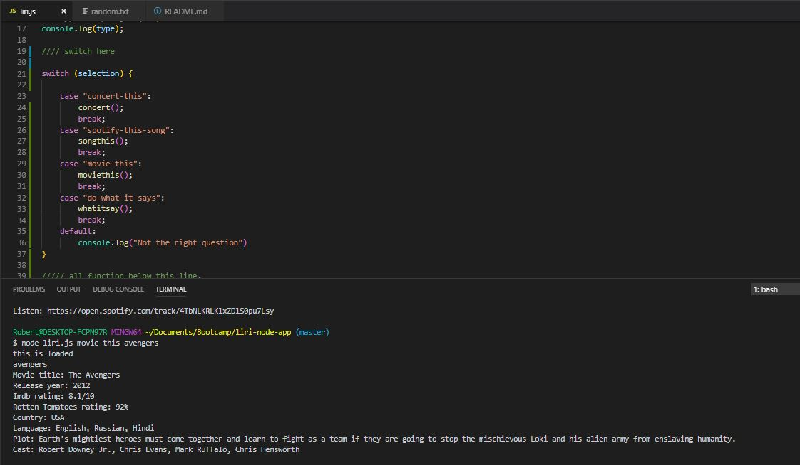

**LIRI** is Language Interpretation and Recognition Interface.  LIRI can be utilized to request information on concerts, movies, and songs.

**LIRI's** three main functions are:

 > 1. concert-this -> then insert artist 

 > 1. spotify-this-song -> then insert song

 > 1. movie-this -> then insert a movie title

**Liri** will then pull data specific to your request.  You can learn about upcoming concerts from your favorite artist, details about your new favorite song, and more information than you could ever want from that movie you just saw.

